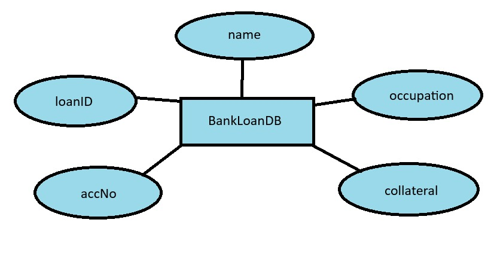

# Ex02 Django ORM Web Application
## Date: 
24/10/24
## AIM
To develop a Django application to store and retrieve data from a bank loan database using Object Relational Mapping(ORM).

## ENTITY RELATIONSHIP DIAGRAM

## DESIGN STEPS

### STEP 1:
Clone the problem from GitHub

### STEP 2:
Create a new app in Django project

### STEP 3:
Enter the code for admin.py and models.py

### STEP 4:
Execute Django admin and create details for 10 books

## PROGRAM
```
models.py

from django.db import models
from django.contrib import admin
class BankLoanDB(models.Model):
     name=models.CharField(max_length=20)
     loanID=models.IntegerField(primary_key="True")
     accNo=models.IntegerField()
     occupation=models.CharField(max_length=20)
     collateral=models.CharField(max_length=30)


class BankLoanDBAdmin(admin.ModelAdmin):
     list_display=('name','loanID','accNo','occupation','collateral')

admin.py

from django.contrib import admin
from .models import BankLoanDB,BankLoanDBAdmin
admin.site.register(BankLoanDB,BankLoanDBAdmin)
```


## OUTPUT
.png>)
Include the screenshot of your admin page.


## RESULT
Thus the program for creating a database using ORM hass been executed successfully
